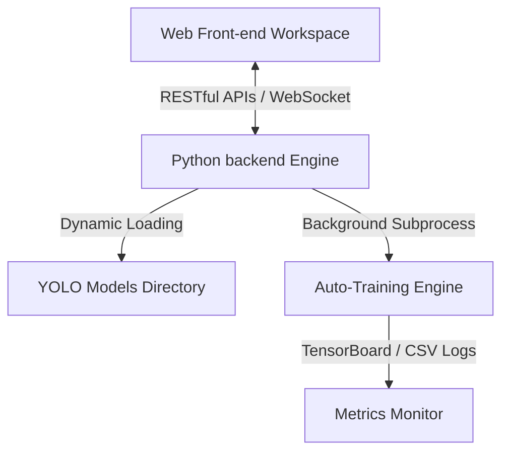

# Skindential AI | 通用 YOLO 檢測與自動訓練工具開發規劃書

本文件為未來系統架構升級之開發文件與設計藍圖，旨在將當前專案重構為「前後端分離」、「API 驅動」、「通用 YOLO 檢測」與「自動化訓練」一體化的通用型視覺診斷平台。

---

## 1. 系統架構設計 (System Architecture)

我們將採用前後端完全解耦的架構，前端負責互動式標記、影像渲染與報告呈現；後端（Flask/FastAPI）負責執行 YOLO 推理與後台模型訓練生命週期管理。



### 1.1 前端 (Frontend)
* **核心職責**：人臉影像展示、標記框拉取/微調、膚況報告儀表板展示。
* **技術棧**：HTML5 Canvas, Vanilla CSS (Glassmorphism), Vanilla JS (未來可平滑遷移至 React / Vue.js)。

### 1.2 後端 (Backend)
* **核心職責**：通用 YOLO 推理 API、資料集管理、非同步背景訓練調度。
* **技術棧**：FastAPI / Flask, PyTorch, Ultralytics YOLO, SQLite (用於存放標記與模型元數據)。

---

## 2. API 介面定義 (API Specification)

為滿足前後端分離與自動化訓練需求，後端應提供以下標準端點：

### 2.1 檢測與推理 API (Detection & Inference)
* **端點**：`POST /api/predict`
* **請求格式**：`Multipart Form Data`
  * `image`: 影像檔案
  * `model_path`: YOLO 權重相對路徑 (例如 `blackbridge_yolo11m_1920_clean/weights/best.pt`)
  * `conf_threshold`: 置信度門檻 (Float, 預設 `0.01`)
  * `iou_threshold`: NMS IOU 門檻 (Float, 預設 `0.70`)
* **回應格式**：
  ```json
  {
    "status": "success",
    "width": 1920,
    "height": 1440,
    "predictions": [
      {
        "box": { "cx": 0.452, "cy": 0.612, "w": 0.05, "h": 0.04 },
        "confidence": 0.86,
        "class_id": 1,
        "class_name": "痤瘡發炎",
        "category": "痤瘡發炎"
      }
    ]
  }
  ```

### 2.2 自動化訓練 API (Auto-Training Lifecycle)
* **啟動訓練**：`POST /api/train/start`
  * **請求參數**：
    ```json
    {
      "model_type": "yolo26m.pt",
      "epochs": 150,
      "imgsz": 1920,
      "batch_size": 2,
      "device": "0",
      "dataset_yaml": "E:/old/blackbridge_yolo/data.yaml"
    }
    ```
  * **動作**：後端利用 `subprocess.Popen` 啟動非同步訓練進程，並為該任務分配唯一 `task_id`，立即返回。
* **查詢訓練狀態**：`GET /api/train/status/<task_id>`
  * **回應格式**：
    ```json
    {
      "task_id": "train_task_001",
      "status": "running",
      "epoch_progress": "45/150",
      "current_loss": {
        "box_loss": 1.95,
        "cls_loss": 1.72
      },
      "metrics": {
        "mAP50": 0.052,
        "precision": 0.165
      }
    }
    ```
* **中止訓練**：`POST /api/train/kill/<task_id>`

---

## 3. 通用檢測與動態加載機制 (Dynamic Model Loading)

後端應具備自動掃描模型目錄並提取類別資訊的能力：
1. **模型元數據提取**：當有新的 `.pt` 模型生成於 `yolo_runs/` 下時，後端利用 `torch.load` 載入權重的 `model.names` 映射字典，動態提供給前端做為類別篩選依據。
2. **記憶體優化緩存**：設計 LRU 緩存機制（如 `loaded_models`），避免在短時間內重複載入相同的巨型權重檔案，最大化推論響應速度。

---

## 4. 自動訓練引擎實現指引 (Auto-Trainer Engine)

後端實現非同步訓練的核心 Python 代碼模板：

```python
import subprocess
import os
import threading

active_train_tasks = {}

def run_training_subprocess(task_id, config):
    cmd = [
        "yolo", "detect", "train",
        f"model={config['model_type']}",
        f"data={config['dataset_yaml']}",
        f"epochs={config['epochs']}",
        f"imgsz={config['imgsz']}",
        f"batch={config['batch_size']}",
        f"device={config['device']}",
        "project=E:/old/blackbridge_yolo/yolo_runs",
        f"name={task_id}"
    ]
    
    # 啟動非同步子進程
    process = subprocess.Popen(
        cmd,
        stdout=subprocess.PIPE,
        stderr=subprocess.STDOUT,
        text=True,
        bufsize=1
    )
    
    active_train_tasks[task_id] = {
        "process": process,
        "log": [],
        "status": "running"
    }
    
    # 即時讀取輸出日誌
    for line in iter(process.stdout.readline, ""):
        active_train_tasks[task_id]["log"].append(line)
        # 可在此處使用正則表達式解析 Epoch 進度與 Loss 並更新狀態
        
    process.stdout.close()
    return_code = process.wait()
    active_train_tasks[task_id]["status"] = "completed" if return_code == 0 else "failed"
```

---

## 5. 未來維護與 Git 部署規範 (Git Workflow & DevOps)
1. **Git LFS 檔案追蹤**：
   * 所有訓練產出的 `yolo_runs/**/weights/*.pt` 必須使用 Git LFS 追蹤。
   * 封裝壓縮的資料集 `*.zip` 使用 LFS 追蹤，避免破壞常規 Git 儲存庫大小。
2. **自動化 Commit**：
   * 每次訓練任務結束後，觸發後台 Shell Script 自動執行：
     ```bash
     git add blackbridge_yolo/yolo_runs/<run_name>/
     git commit -m "fit: auto-commit training metrics and weights for <run_name>"
     git push origin main
     ```
